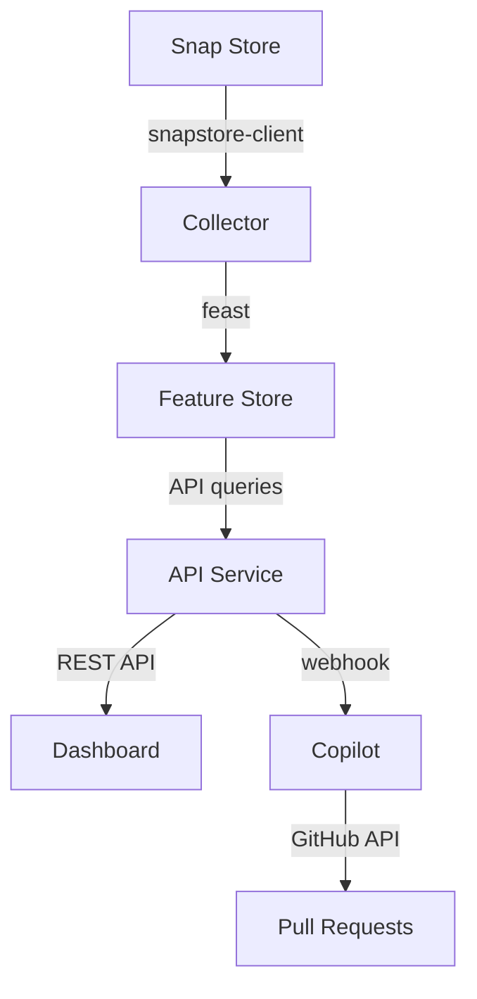

# SnapPulse Development Guide

## 🛠️ Development Setup

### Prerequisites

```bash
# System dependencies
sudo snap install microk8s --classic --channel=1.32/stable
sudo snap install juju --classic --channel=3.6/stable
sudo snap install node --classic
sudo snap install charmcraft --classic

# Python dependencies
pip install fastapi uvicorn feast snapstore-client transformers torch
```

### Local Development

#### 1. Collector Service

```bash
cd services/collector
export SNAP_NAME=firefox
python3 app.py
```

#### 2. API Service

```bash
cd services/api
uvicorn main:app --reload --port 8000
```

#### 3. Dashboard Service

```bash
cd services/dashboard
npm install
npm run dev
```

#### 4. Copilot Service

```bash
cd services/copilot
python3 main.py
```

## 🧪 Testing

### API Testing

```bash
# Health check
curl http://localhost:8000/health

# Get snap stats
curl http://localhost:8000/stats/firefox/stable

# Get trending snaps
curl http://localhost:8000/trending
```

### Dashboard Testing

```bash
# Open in browser
open http://localhost:3000

# Or test API connectivity
curl http://localhost:3000
```

### Copilot Testing

```bash
# Test analysis endpoint
curl -X POST http://localhost:8001/analyze \
  -H "Content-Type: application/json" \
  -d '{
    "snapcraft_yaml": "name: test\nversion: 1.0\nbase: core22",
    "repository_url": "https://github.com/test/test",
    "issue_number": 1
  }'
```

## 🏗️ Building and Deployment

### Build Charms

```bash
# Build all charms
./scripts/build-charms.sh

# Or build individually
cd charms/collector
charmcraft pack
```

### Deploy to MicroK8s

```bash
# Deploy everything
./scripts/deploy.sh

# Check status
juju status

# View logs
juju debug-log
```

### Build Snap Package

```bash
cd snap
snapcraft pack --destructive-mode
sudo snap install snap-pulse_*.snap --dangerous
```

## 🔧 Configuration

### Environment Variables

#### Collector
- `SNAP_NAME`: Snap package to monitor (default: firefox)

#### API
- `PORT`: API port (default: 8000)

#### Dashboard
- `NEXT_PUBLIC_API_URL`: API endpoint URL
- `PORT`: Dashboard port (default: 3000)

#### Copilot
- `GITHUB_TOKEN`: GitHub personal access token for PR creation
- `PORT`: Copilot port (default: 8001)

### Charm Configuration

```bash
# Configure collector
juju config collector snap-name=discord

# Configure dashboard API URL
juju config dashboard api-url=http://custom-api:8000

# Set GitHub token for copilot
juju config copilot github-token=ghp_xxxxxxxxxxxx
```

## 📊 Data Flow



## 🧩 Adding Features

### New API Endpoint

1. Add route to `services/api/main.py`
2. Update API charm if needed
3. Test locally with `uvicorn main:app --reload`

### New Dashboard Page

1. Create component in `services/dashboard/app/`
2. Add to navigation
3. Test with `npm run dev`

### New Copilot Feature

1. Extend `services/copilot/main.py`
2. Add new analysis logic
3. Update prompt templates

### New Data Source

1. Extend collector in `services/collector/app.py`
2. Update Feast schema if needed
3. Modify API to expose new data

## 🐛 Debugging

### Service Logs

```bash
# Juju application logs
juju debug-log --include=collector
juju debug-log --include=api
juju debug-log --include=dashboard
juju debug-log --include=copilot

# Container logs
kubectl logs -f deployment/collector
```

### Common Issues

#### Charm Build Fails
```bash
# Clean and rebuild
charmcraft clean
charmcraft pack --force
```

#### Service Won't Start
```bash
# Check Juju status
juju status --relations

# Check container logs
juju debug-log --include=<service-name>
```

#### Dashboard Can't Reach API
```bash
# Check API endpoint
curl http://<api-ip>:8000/health

# Verify CORS settings in API
```

## 📈 Performance Tuning

### Collector Optimization
- Adjust polling interval in `app.py`
- Batch multiple snap queries
- Implement caching for repeated requests

### API Optimization
- Add Redis caching layer
- Implement connection pooling
- Use async database queries

### Dashboard Optimization
- Implement SWR caching
- Add service worker for offline support
- Optimize chart rendering

### Copilot Optimization
- Use model quantization (already implemented)
- Cache model responses
- Implement async processing queue

## 🚀 Deployment Strategies

### Development
```bash
./scripts/deploy.sh
```

### Production
```bash
# Use specific revisions
juju deploy ./kubernetes/bundle.yaml --channel=stable

# Scale services
juju scale-application api 3
juju scale-application dashboard 2
```

### Cloud Deployment
```bash
# AWS
juju bootstrap aws/us-east-1
juju deploy ./kubernetes/bundle.yaml

# Azure
juju bootstrap azure/eastus
juju deploy ./kubernetes/bundle.yaml
```

## 📚 References

- [Juju Documentation](https://juju.is/docs)
- [Charmcraft Guide](https://juju.is/docs/sdk)
- [MicroK8s Setup](https://microk8s.io/docs)
- [Feast Documentation](https://docs.feast.dev/)
- [FastAPI Documentation](https://fastapi.tiangolo.com/)
- [Next.js Documentation](https://nextjs.org/docs)
